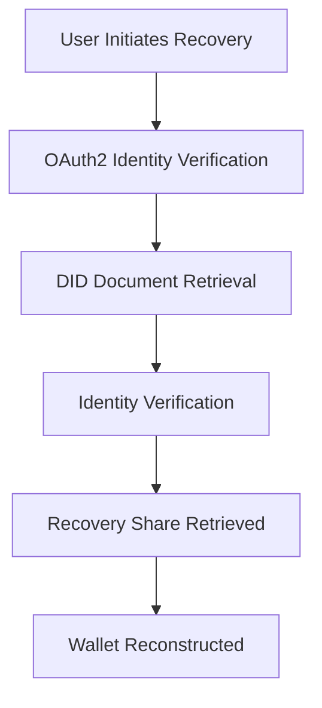
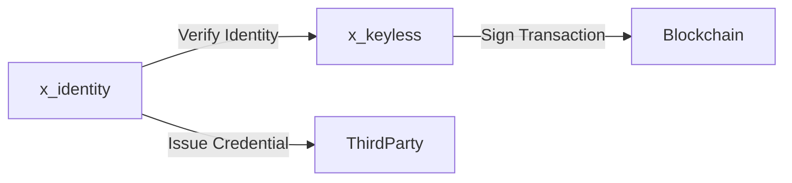
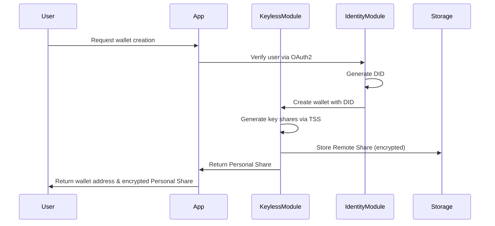
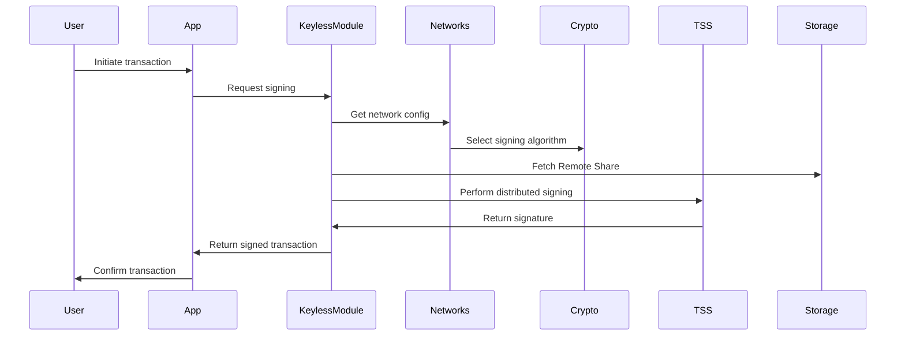
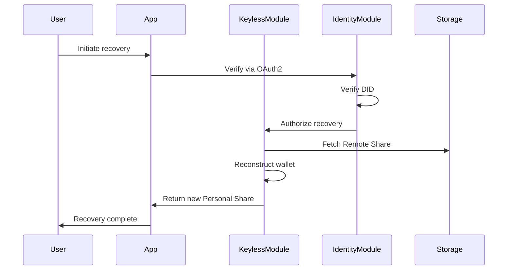

# Identity and Keyless Modules for Self Chain (Updated)

## **1. Overview**
Self Chain aims to introduce two innovative modules:
- **Keyless Wallet Module (`x/keyless`)**: Eliminate the need for private keys by leveraging distributed key shares and threshold cryptography (MPC-TSS) for secure signing and wallet management.
- **Identity Module (`x/identity`)**: Simplify user authentication and wallet recovery through decentralized identifiers (DIDs), social login (OAuth2), and identity-based recovery mechanisms.

These modules will enhance user security, eliminate single points of failure, and provide a seamless recovery experience while aligning with decentralized identity standards.

---

## **2. Objectives**
- Implement **true keyless wallets** by eliminating private keys and introducing distributed signing using MPC-TSS.
- Support signing for various blockchain networks, ensuring compatibility with multiple signing algorithms (e.g., ECDSA, EdDSA, Schnorr, BLS) using a generic framework.
- Provide a user-friendly recovery process using **DID-based identity verification** through social login.
- Ensure high security with encrypted storage, rate limiting, and optional multi-factor authentication (MFA).
- Align the Identity Module with **W3C DID standards** for interoperability and extensibility.

---

## **3. Requirements**
### **Functional Requirements**
1. **Keyless Wallet Creation**
   - The system must enable users to create wallets without requiring private keys.
   - Wallets must be created using distributed key shares generated via MPC-TSS.
2. **Secure Transaction Signing**
   - The system must support signing transactions across multiple blockchain networks using different algorithms.
   - The signing process must ensure that key shares never come together.
3. **Wallet Recovery Mechanism**
   - The system must provide a recovery mechanism based on identity verification using DIDs.
   - Recovery should be initiated through social login or other identity-based methods.
4. **Identity Management**
   - The system must generate and manage decentralized identifiers (DIDs) for users.
   - The system must support linking DIDs to social login credentials.
5. **Credential Issuance and Verification**
   - The system must enable third-party entities to issue verifiable credentials tied to users' DIDs.
   - Users must be able to present and verify these credentials.

### **Non-Functional Requirements**
1. **Security**
   - The system must use encrypted storage for all key shares.
   - The system must implement rate limiting and MFA to prevent unauthorized access.
2. **Performance**
   - Signing latency must be under 1 second.
   - The recovery process should have a success rate of over 99%.
3. **Scalability**
   - The system must support additional blockchain networks and new signing algorithms without major architectural changes.
4. **Interoperability**
   - The identity module must align with W3C DID standards to ensure interoperability.

---

## **4. Key Features**
### **A. Keyless Wallet Module (`x/keyless`)**
#### **1. Wallet Creation**
- **Distributed Key Shares**: Generate key shares using MPC and store them securely:
   - **Personal Share**: Encrypted and stored on the user's device.
   - **Remote Share**: Stored on-chain or distributed across MPC nodes.
   - **Recovery Share**: Managed through the `x/identity` module via DID-based recovery.

#### **2. Generic Multi-Network Signing Support**
- Dynamically select signing algorithms (e.g., ECDSA, EdDSA) based on network-specific metadata.
- Ensure extensibility to support future blockchain networks.

#### **3. Secure Signing Process**
- Use threshold cryptography (MPC-TSS) to ensure key shares never come together during signing.

#### **4. Wallet Recovery**
- Recovery initiated via `x/identity` by verifying the user's identity through DIDs.
- Reconstruct the wallet using the authenticated Recovery Share.

#### **5. Key APIs**
- **`CreateWallet`**: Generates distributed key shares.
- **`SignTransaction`**: Enables distributed signing across multiple networks.
- **`RecoverWallet`**: Recovers the wallet using identity verification.

### **B. Identity Module (`x/identity`)**
#### **1. DID Creation**
- Generate unique DIDs for users, e.g., `did:selfchain:123456789abcdef`.
- Store DID documents on-chain with public keys, verification methods, and service endpoints.

#### **2. Social Login Integration**
- Support OAuth2 for providers like Google, Apple, and GitHub.
- Link user identity to their DID during wallet creation.

#### **3. Identity Verification and Recovery Flow**
**Recovery Flow:**
1. User initiates recovery via the Self Chain interface.
2. Identity is verified using OAuth2 tokens.
3. DID document is retrieved and verified on-chain.
4. Upon successful verification, the `x/keyless` module reconstructs the wallet.

#### **4. Credential Issuance and Verification**
- Enable third parties to issue verifiable credentials (e.g., KYC, DAO memberships).
- Allow users to selectively disclose credentials for authentication.

#### **5. Key APIs**
- **`RegisterIdentity`**: Links social login credentials to a DID.
- **`VerifyIdentity`**: Validates identity for recovery.
- **`AuthorizeRecovery`**: Grants recovery access to the `x/keyless` module.
- **`IssueCredential`**: Issues verifiable credentials.
- **`VerifyCredential`**: Verifies credentials presented by users.

---

## **5. Use Cases**
### **Use Case 1: Keyless Wallet Creation**
**Actors:** User, Self Chain system

**Description:**
A user creates a keyless wallet through the Self Chain interface. The system generates distributed key shares using MPC-TSS and stores them securely. The wallet is associated with a DID.

**Steps:**
1. User requests wallet creation.
2. System generates key shares (Personal Share, Remote Share).
3. Personal Share is encrypted and stored on the user's device.
4. Remote Share is stored in the Self Chain network.
5. Wallet is linked to a DID.

**Outcome:**
User has a secure, keyless wallet with recovery options via DID.

### **Use Case 2: Transaction Signing**
**Actors:** User, Self Chain system, Blockchain network

**Description:**
A user initiates a transaction on a blockchain network. The Self Chain system uses distributed signing to sign the transaction without assembling the full private key.

**Steps:**
1. User initiates a transaction.
2. System fetches the Remote Share from storage.
3. System performs distributed signing using MPC-TSS.
4. Transaction is signed and submitted to the blockchain network.

**Outcome:**
Transaction is securely signed and validated on the blockchain.

### **Use Case 3: Wallet Recovery**
**Actors:** User, Self Chain system, Identity Provider

**Description:**
A user loses their device and initiates wallet recovery. The system verifies the user's identity through OAuth2 and DIDs, retrieves the Remote Share, and reconstructs the wallet.

**Steps:**
1. User initiates recovery via the Self Chain interface.
2. System verifies identity using OAuth2 (e.g., Google login).
3. System retrieves and verifies the DID document.
4. Upon successful verification, the system reconstructs the wallet.

**Outcome:**
User regains access to their keyless wallet.

---

## **6. Detailed Step-by-Step Implementation Plan Using Ignite CLI**

### **Step 1: Set Up the Development Environment**
1. Install **Ignite CLI** version `v0.27.1`.
2. Clone the existing Self Chain repository.
3. Install dependencies:
   - **TSS-lib** for distributed signing.
   - **Go-OAuth2** for social login integration.
   - **did-jwt** for managing decentralized identifiers.
4. Set up a local Cosmos SDK testnet for validation.

### **Step 2: Create the `x/keyless` Module**
1. Use `ignite scaffold module keyless` to create the module.
2. Implement the **`CreateWallet`** functionality:
   - Generate distributed key shares using **TSS-lib**.
   - Store Personal Share on the user’s device and Remote Share in **KVStore**.
   - Link the wallet to a DID.
3. Implement the **`SignTransaction`** functionality:
   - Fetch Remote Share from **KVStore**.
   - Use **TSS-lib** to perform distributed signing.
   - Ensure multi-network signing support by dynamically selecting the correct algorithm.
4. Implement the **`RecoverWallet`** functionality:
   - Authenticate user identity using the `x/identity` module.
   - Fetch and decrypt Remote Share.
   - Reconstruct the wallet.

### **Step 3: Create the `x/identity` Module**
1. Use `ignite scaffold module identity` to create the module.
2. Implement **DID creation** and storage:
   - Generate a DID and associate it with the user’s social login credentials.
   - Store the DID document on-chain.
3. Implement **OAuth2 integration**:
   - Use **Go-OAuth2** to support Google, Apple, and GitHub logins.
4. Implement **identity verification**:
   - Verify OAuth2 tokens and retrieve the associated DID document.
5. Implement **Credential Issuance and Verification**:
   - Allow trusted third parties to issue credentials.
   - Implement APIs for users to present and verify credentials.

### **Step 4: Integration of Modules**
1. Integrate `x/keyless` with `x/identity` for wallet recovery workflows.
2. Ensure secure communication between modules via gRPC.
3. Set up unit tests to validate key workflows:
   - Wallet creation.
   - Transaction signing.
   - Wallet recovery.

### **Step 5: Testing and Validation**
1. **Unit Testing**: Test individual functions within the modules.
2. **Integration Testing**: Validate workflows across modules.
3. **Performance Testing**: Measure signing latency and recovery success rates.

### **Step 6: Deployment**
1. Deploy the modules on a testnet.
2. Gather user feedback and address issues.
3. Finalize the deployment on the mainnet.

---

## **7. Enhanced Success Metrics**
| **Metric Type**       | **Description**                        | **Target**         |
|-----------------------|----------------------------------------|--------------------|
| Performance           | Signing latency                        | < 1 second         |
| Recovery Success Rate | Successful recoveries vs. failures      | > 99%              |
| Security              | Unauthorized recovery attempts blocked | 100%               |
| User Adoption         | User retention and feedback scores      | > 80% positive     |

---

## **8. Deployment and Maintenance Plan**
### **Deployment**
- **Testnet Deployment**: Use Ignite CLI to deploy modules on testnet.
- **Mainnet Deployment**: Finalize and deploy on mainnet with documentation and user support.

### **Maintenance**
- Regular updates for security patches.
- Ongoing user support and incident response plan.

---

## **9. Visuals for Key Processes**
### **Wallet Recovery Flow**

### **Module Integration Flow**

## Keyless Wallet Creation Flow

## Transaction Signing Flow

## Wallet Recovery Flow

